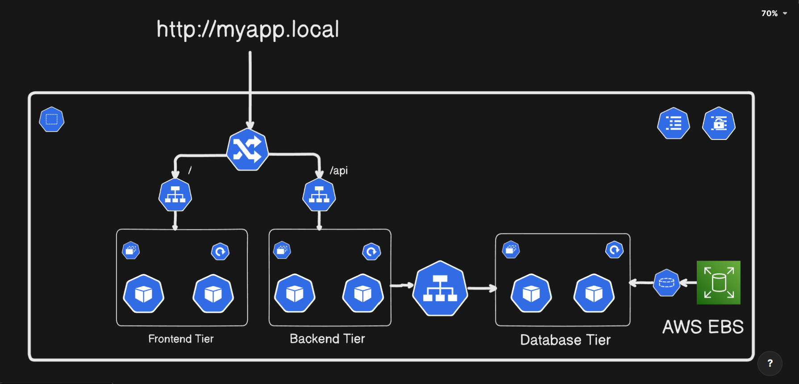

# **Kubernetes Project Series: Project3**

## **Kubernetes Stateful Infrastructure with Dynamic Storage and Ingress Routing**

This project demonstrates the deployment of a stateful application on Kubernetes using StatefulSet for database management and StorageClass for dynamic volume provisioning with external EBS. A headless service is configured to ensure stable network identities, while Ingress enables external access to the application. This setup ensures high availability, data persistence, and scalable infrastructure suitable for production-grade workloads.

### **Architecture Diagram**

### *Note:*
- **Complete Source Code**: https://github.com/sainathPatil09/Rating-App/tree/k8s
- **switch** to `k8s` branch

### **Topics to cover**
- **Stateless VS Stateful** - why we need statefulset when we have deployments
- **StatefulSet** – for stable and persistent DB pods
- **StorageClass** – for dynamic provisioning of volume
- **Headless Service** – for stable DNS/network identity
- **Ingress** – for external access and routing
- We will setup everything on **EKS** which is AWS Kubernetes Service

### **Lets start**
#### **1. Stateless VS Stateful**
- **Stateful**: A database pod storing customer orders, if it restarts, data must still be there.
    - **In Short:** remembers previous interactions (needs persistence).

- **Stateless**: A login API, if the pod restarts, the next request can go to any other pod.
    - **In Short:** treats each interaction independently (easier to scale).

| Aspect | Stateful Application | Stateless Application |
|---|---|---|
| State Management | Stores state (data/sessions) on the server or attached storage | Does not store state on the server between requests |
| Data Persistence | State/data persists across restarts and scaling | No persistence; each request is independent |
| Examples | Databases (MySQL, PostgreSQL), message queues, file servers | Web APIs, front-end apps, microservices returning data |

#### **2. Statefulsets**
- What is Statefulset?
    - A StatefulSet is a Kubernetes resource used to manage stateful applications, applications that require persistent identity, storage, and ordered deployment.
- Why we need Statefulset over Deployments for **DATABASES**?
    - **Stable Pod Identity:** Each pod gets a unique, predictable name (mypod-0, mypod-1, …).

    - **Stable Network Identity:** Each pod has a consistent DNS hostname that doesn’t change even if the pod is restarted.

    - **Persistent Storage:** Each pod can have its own PersistentVolumeClaim (PVC), which persists across restarts.

    - **Ordered Deployment & Scaling:** Pods are created, updated, and deleted in sequence, ensuring proper initialization.

| **Feature**            | **Deployment**                       | **StatefulSet**                             |
| ---------------------- | ------------------------------------ | ------------------------------------------- |
| Pod Identity           | Dynamic, changes on restart          | Stable and predictable (`name-0`, `name-1`) |
| Network Identity (DNS) | Random, not guaranteed               | Stable DNS for each pod                     |
| Storage                | Usually ephemeral, shared PVC tricky | Each pod has its own persistent volume      |
| Scaling / Ordering     | No guaranteed order                  | Ordered creation, scaling, and deletion     |
| Use Case               | Stateless apps (API, frontend)       | Stateful apps (DBs, queues, caches)         |

**In Short:**
- Use Deployment for stateless apps.
- Use StatefulSet for stateful apps like MySQL, PostgreSQL, Kafka, or Redis, where data persistence and stable identities are critical

#### **3. StorageClass**
- A StorageClass in Kubernetes defines how storage should be **dynamically provisioned**.
- **Why we need it:**
    - Without StorageClass: you’d have to manually create PersistentVolumes.
    - With StorageClass: Kubernetes automatically creates PVs when a pod requests storage.
    - Makes storage dynamic, scalable, and cloud-provider friendly
- **VolumeClaimTemplate:**  A VolumeClaimTemplate is a template for creating PVCs (PersistentVolumeClaims) for each replica in a StatefulSet

#### **4. Headless Service**
- A Headless Service in Kubernetes is a **Service without a ClusterIP.**
    - Has no ClusterIP `(clusterIP: None)`
    - Does not load-balance traffic.
    - Instead, it returns the DNS records of individual pods.
    - `<pod-name>.<service-name>.<namespace>.svc.cluster.local`

#### **5. Ingress**
- Ingress in Kubernetes is an API object that **manages external access to services inside the cluster** over `HTTP and HTTPS`.
- Why to use Ingress:
    - **Use NodePort:** but that exposes each service on a random port (not production friendly).
    - **Use LoadBalancer** but each service gets its own external load balancer (expensive and hard to manage if you have many services).
- Ingress solves this problem by:
    - Allowing multiple services to be accessed through a single external IP / LoadBalancer.
    - Supporting routing based on domains and paths.
    - Enabling SSL/TLS termination, centralized authentication, and other advanced features.

#### **6. IAM OIDC Provider**
- What is an IAM OIDC Provider?

    - An IAM OIDC provider (OpenID Connect provider) in Amazon Web Services is a trusted identity provider that allows AWS services (like EKS) to verify identities and issue temporary credentials to workloads.

    - **In simple terms:** OIDC provider = a secure way to let your Kubernetes pods access AWS resources without needing long-term credentials.

#### **7. EBS CSI DRIVER**

- What is EBS CSI Driver?

    - The AWS EBS CSI Driver is a Container Storage Interface (CSI) driver that lets your Kubernetes cluster use Amazon Elastic Block Store (EBS) volumes as persistent storage for your pods.
    - EBS = Block-level storage volumes on AWS.
    - CSI Driver = A plugin that allows Kubernetes to connect to different storage systems.
    - So, EBS CSI Driver = a bridge between Kubernetes and EBS.
    - In simple words:
        “It allows pods in your EKS cluster to dynamically create, attach, and use EBS volumes as persistent disks.”

